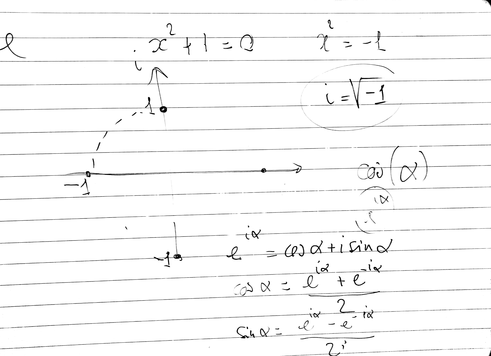
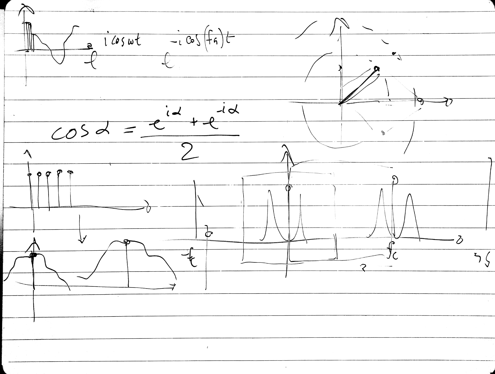

# CSEDSM 2 - Lezione del 9 gennaio 2018

## Argomenti

* Tecniche di analisi: l'analisi per scomposizione in serie di Fourier
  * ripasso del dominio dei numeri complessi
  * concetti di scomposizione in serie di fenomeni periodici
  * la `discrete Fourier transform` (DFT)
    * su una funzione complessa
    * su una funzione reale

