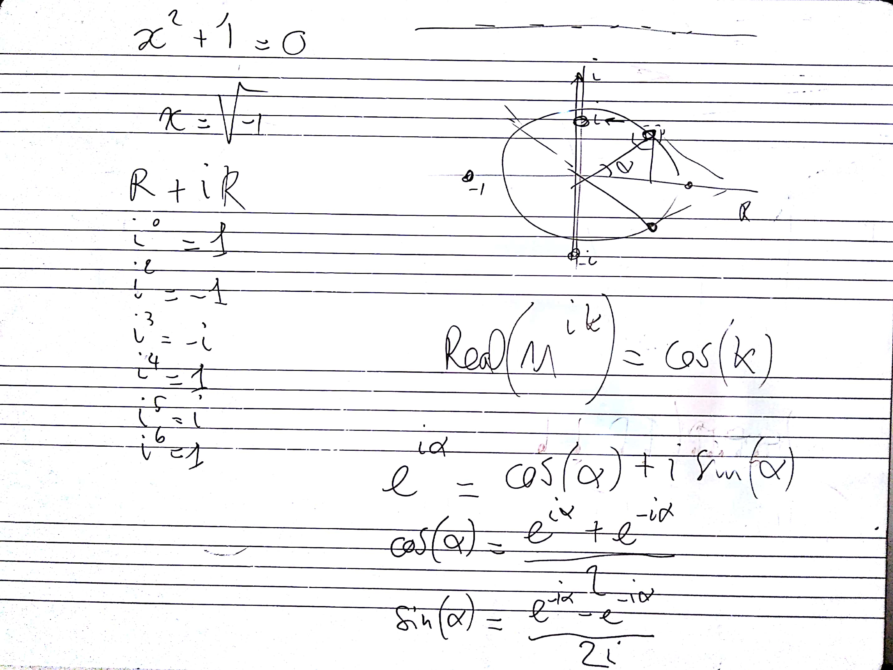
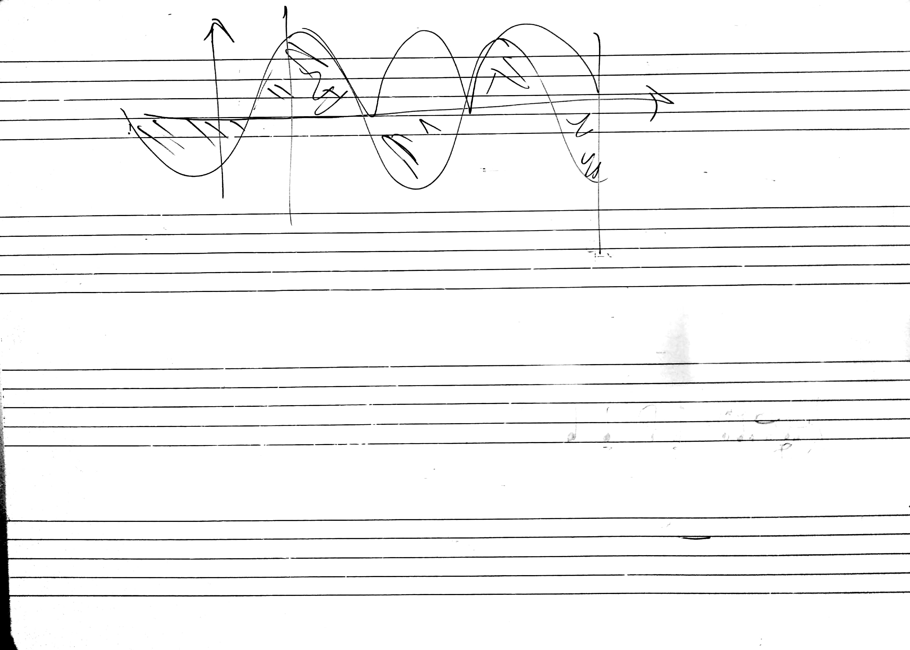
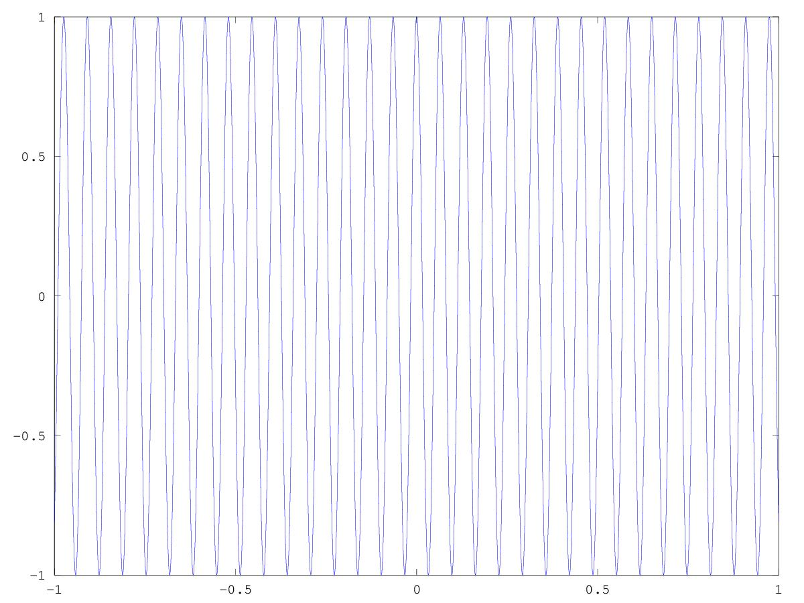
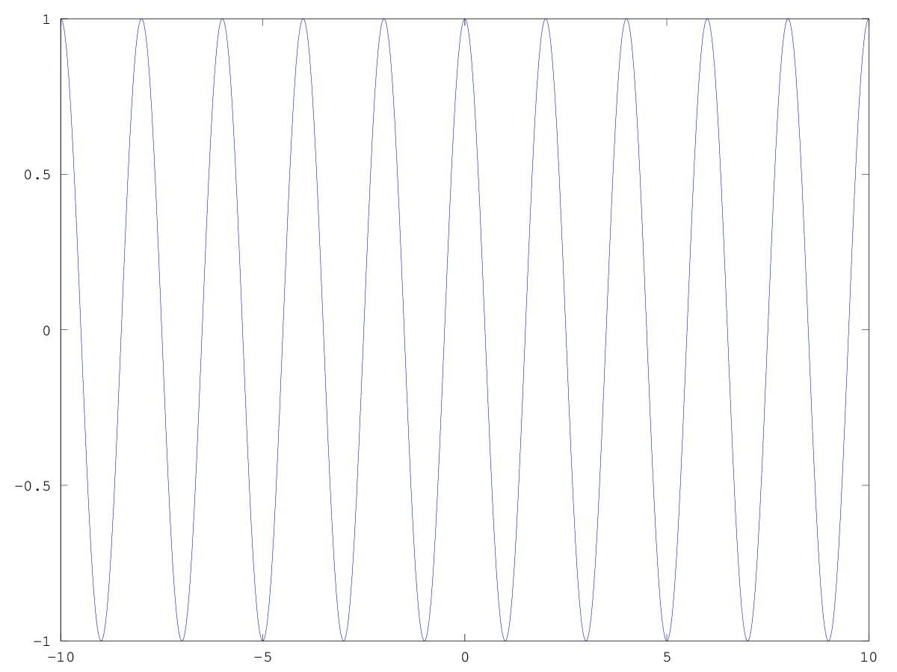
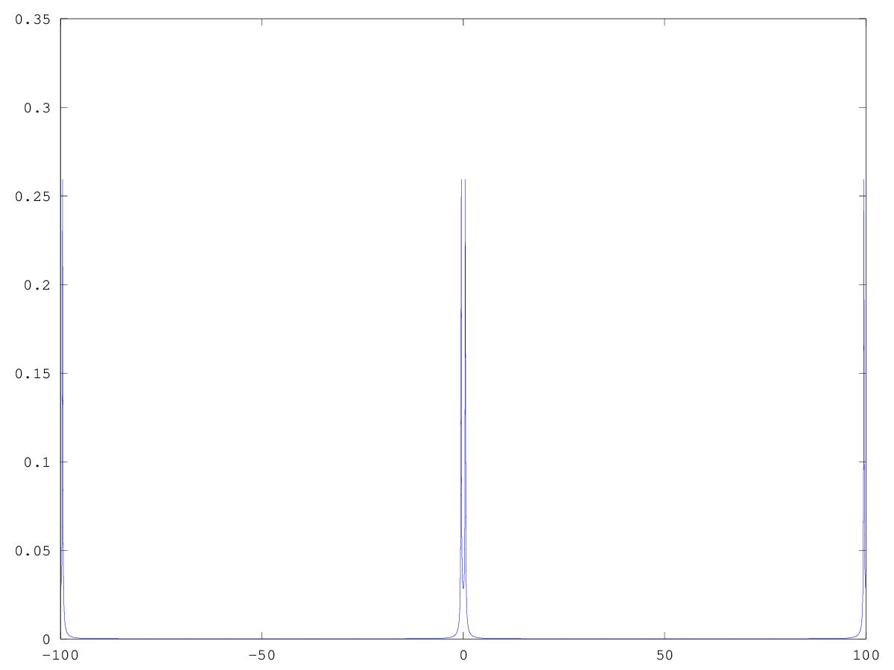
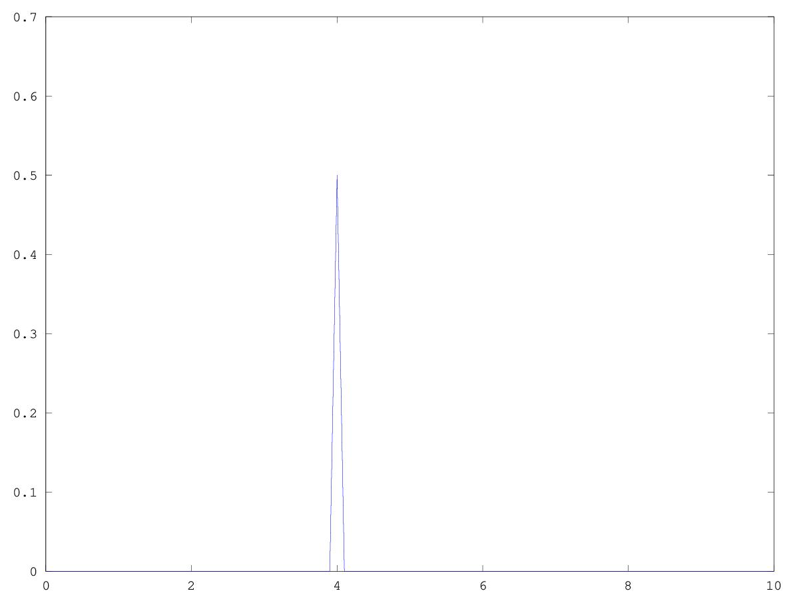

# CSEDSM 2 - Lezione del 23 gennaio 2018

## Argomenti

* Revisione della lezione precedente





### Codice prodotto

#### le3_p1.m

```matlab
f1 = 0.3;
f2 = 15.1;
t = [-1:0.001:1];
z1 = e.^(f1*2*pi*t*i);
z2 = e.^(f2*2*pi*t*i);

z = z1.*z2;

%plot(t,real(z),t,imag(z))
plot(t,z)

sum(z(100:900))
```

produce



#### dft1.m

```matlab
t = [-10:0.01:10];
sz = size(t,2);
F= [-10:0.1:10];
f = 0.5;

dft = zeros(1,size(F,2));

z = e.^(2*pi*f*t*i);

for ( k =(1:size(F,2)))
  fa= F(k);
  za = e.^(2*pi*fa*t*-i);
  zout = za.*z;
  dft(k) = abs(sum(zout))/sz;
  end
  plot(t,z)

 % plot(F,dft)
```

produce



#### dft2.m

```matlab
t = [-10:0.01:10];
sz = size(t,2);
F= [-100:0.1:100];
f = 0.53;

dft = zeros(1,size(F,2));

z = cos(2*pi*f*t);

for ( k =(1:size(F,2)))
  fa= F(k);
  za = e.^(2*pi*fa*t*-i);
  zout = za.*z;
  dft(k) = abs(sum(zout))/sz;
  end

  plot(F,dft)
```

produce



#### dft3.m

```matlab
t = [-10:0.001:10];
sz = size(t,2);
F= [0:0.1:10];
f = 4;

dft = zeros(1,size(F,2));

z = cos(2*pi*f*t);
for ( k =(1:size(F,2)))
fa= F(k);
za = e.^(2*pi*fa*t*-i);
 zout = za.*z;
 dft(k) = (sum(zout))/sz;
  end

plot(F,dft)
```

produce


