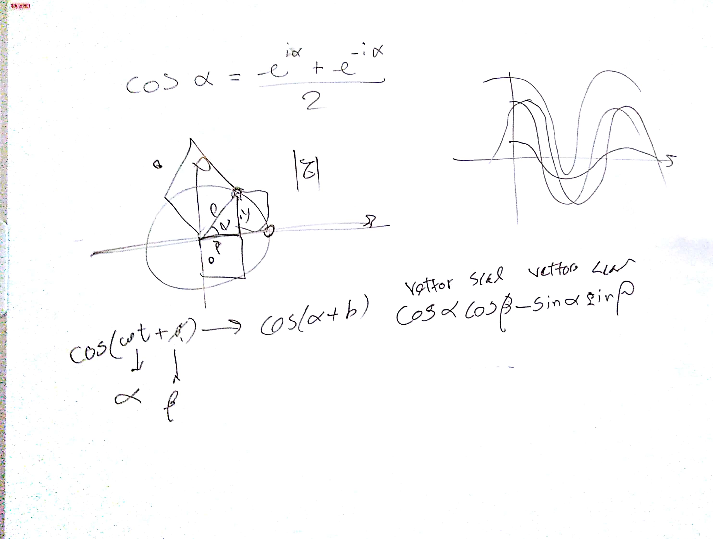

# CSEDSM 2 - Lezione del 20 febbraio 2018

## Argomenti

* ripasso dei concetti espressi in precedenza
* passaggio dal dominio reale al dominio complesso e viceversa:
  l'abolizione della trigonometria

## Lavagne:

