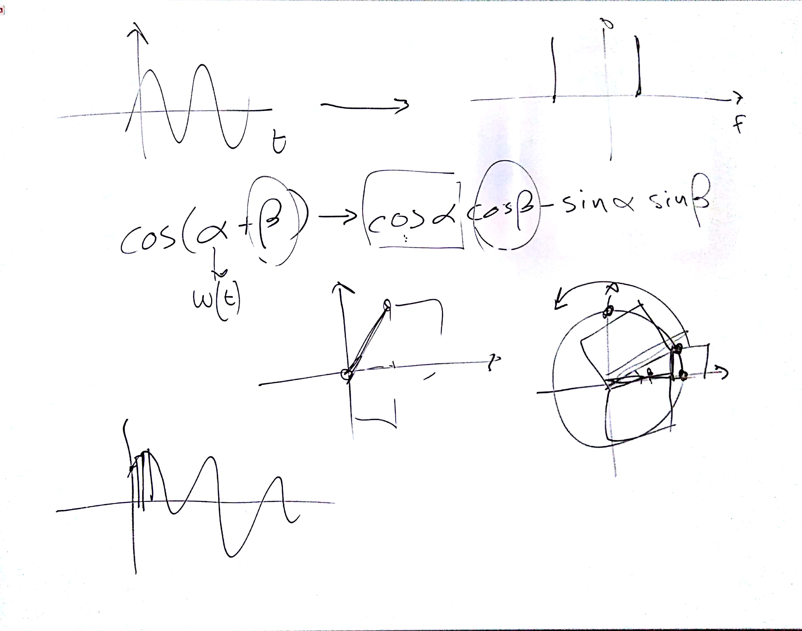
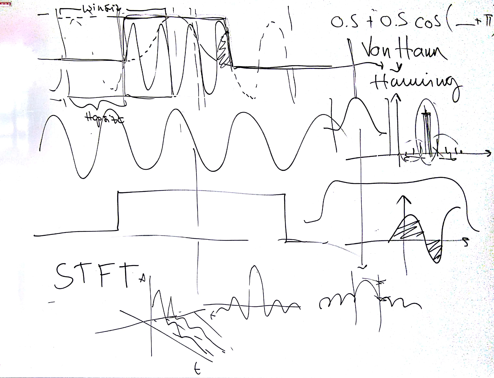

# CSEDSM 2 - Lezione del 10 aprile 2018

## Argomenti

* Tecniche di analisi: l'analisi per scomposizione in serie di Fourier
  * compromesso tempo/frequenza:
    * precisione frequenziale
    * precisione temporale
    * short time fourier transform (introduzione)

## Lavagne

